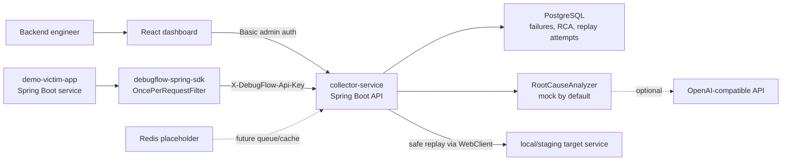

# DebugFlow

DebugFlow is an MVP for backend teams that need to capture failed API requests, inspect the exact failure context, ask for root-cause analysis, and safely replay failures against non-production targets.

It is built as a production-style monorepo, but intentionally stays small: one collector service, one Spring SDK, one demo app, one React dashboard, and Docker Compose for local infrastructure.

## What DebugFlow Does

DebugFlow helps answer a common backend question: "This API failed in staging or local. What exactly happened, and can I reproduce it safely?"

The MVP can:

- Capture failed HTTP requests from Spring Boot services.
- Store request, response, exception, trace, latency, and service metadata.
- Mask sensitive headers before persistence.
- Truncate large bodies before storage.
- List and filter captured failures in a dashboard.
- Show detailed failure context for debugging.
- Generate mock or OpenAI-compatible root-cause analysis.
- Replay eligible failures against a caller-provided local or staging target.
- Block production replay and require explicit opt-in for payment paths.

## Architecture



## Tech Stack

- Backend: Java 21, Spring Boot 3, Spring Web, Spring Data JPA, Spring Security
- Database: PostgreSQL with Flyway migrations
- AI: OpenAI-compatible analyzer interface, mock provider enabled by default
- Replay: Spring WebClient
- SDK: Java Spring Boot starter-style module
- Frontend: React, TypeScript, Vite, Tailwind, React Router
- Infra: Docker Compose
- Future cache/queue placeholder: Redis
- Tests: JUnit 5, Spring Boot Test, Testcontainers for PostgreSQL

## Repository Layout

```text
collector-service/  Spring Boot API for ingestion, persistence, analysis, and replay
spring-sdk/         Spring Boot SDK module for sending failures to DebugFlow
demo-victim-app/    Demo Spring Boot service that emits SDK failure events
web-dashboard/      React, TypeScript, Vite, and Tailwind dashboard
infra/              Docker Compose and local infrastructure config
```

## Local Demo With Docker Compose

Requirements:

- Docker Desktop or Docker Engine with Compose
- Ports `5432`, `8080`, `8081`, and `5173` available

Start the full local demo stack:

```bash
docker compose --env-file infra/.env.example -f infra/docker-compose.yml --profile dashboard up --build
```

Services:

- Collector API: `http://localhost:8080`
- Demo victim app: `http://localhost:8081`
- Dashboard: `http://localhost:5173`
- PostgreSQL: `localhost:5432`

Default local credentials:

- Admin username: `debugflow`
- Admin password: `debugflow`
- Seeded local project API key: `debugflow-local-dev-key`

The seeded API key is stored in PostgreSQL as a salted SHA-256 hash. The raw API key is only used by SDKs and ingestion clients.

To stop the stack:

```bash
docker compose --env-file infra/.env.example -f infra/docker-compose.yml --profile dashboard down
```

To reset local data:

```bash
docker compose --env-file infra/.env.example -f infra/docker-compose.yml --profile dashboard down -v
```

## Trigger Demo Failures

The demo victim app has one healthy endpoint and several failing endpoints. The DebugFlow SDK is configured in the demo app and sends captured failures to the collector.

Healthy request, not captured:

```bash
curl http://localhost:8081/api/healthy
```

Runtime exception, captured:

```bash
curl http://localhost:8081/api/fail/runtime
```

Downstream timeout simulation, captured:

```bash
curl http://localhost:8081/api/fail/downstream
```

Payment token failure, captured:

```bash
curl \
  -H "Content-Type: application/json" \
  -H "Authorization: Bearer demo-secret" \
  -X POST http://localhost:8081/api/payments/charge \
  -d '{"token":"expired","customerId":"cus_demo","amountCents":4200}'
```

Sensitive headers such as `Authorization`, `Cookie`, `Set-Cookie`, `X-Api-Key`, and `X-DebugFlow-Api-Key` are masked before storage.

## Open The Dashboard

Open:

```text
http://localhost:5173
```

The dashboard uses basic admin auth when calling collector APIs. In local development, credentials are configured through:

```text
VITE_API_USERNAME=debugflow
VITE_API_PASSWORD=debugflow
```

In the dashboard you can:

- View the failure list.
- Filter by service, status code, environment, and date range.
- Open a failure detail page.
- Inspect request headers, request body, response headers, response body, and stack trace.
- Run root-cause analysis.
- Replay eligible local or staging failures.
- Review previous replay attempts.

## API Quick Start

Direct ingestion uses project API-key auth:

```bash
curl \
  -H "X-DebugFlow-Api-Key: debugflow-local-dev-key" \
  -H "Content-Type: application/json" \
  -X POST http://localhost:8080/api/v1/events/failures \
  -d '{
    "serviceName": "checkout-service",
    "environment": "local",
    "traceId": "trace-local-001",
    "spanId": "span-local-001",
    "httpMethod": "POST",
    "path": "/api/orders",
    "queryString": "debug=true",
    "statusCode": 500,
    "latencyMs": 1250,
    "exceptionType": "java.sql.SQLTransientConnectionException",
    "exceptionMessage": "database timeout",
    "requestHeaders": {
      "Authorization": "Bearer secret",
      "Content-Type": "application/json"
    },
    "requestBody": "{\"sku\":\"sku_123\"}",
    "responseHeaders": {
      "Set-Cookie": "session=secret",
      "Content-Type": "application/json"
    },
    "responseBody": "{\"error\":\"database timeout\"}"
  }'
```

Dashboard and admin APIs use basic auth:

```bash
curl -u debugflow:debugflow http://localhost:8080/api/v1/events/failures
```

Create another local testing project and one-time API key:

```bash
curl \
  -u debugflow:debugflow \
  -H "Content-Type: application/json" \
  -X POST http://localhost:8080/api/admin/projects/dev-key \
  -d '{"name":"Local Sandbox"}'
```

The response includes `apiKey` once. Store it in SDK config. DebugFlow never returns `apiKeyHash` in API responses.

## AI Analysis

Run analysis from the dashboard, or call:

```bash
curl \
  -u debugflow:debugflow \
  -X POST http://localhost:8080/api/v1/events/failures/1/analyze
```

The analyzer returns:

- `summary`
- `likelyCause`
- `suggestedFix`
- `confidence`

By default, DebugFlow uses `MockRootCauseAnalyzer`. It inspects fields such as status code, exception message, stack trace, and response body.

Current mock rules include:

- Timeout text suggests a downstream timeout.
- `401` or `403` suggests auth or token issues.
- `500` with `NullPointerException` suggests a null handling bug.
- Payment or token text suggests an expired OAuth or payment token.

To enable the OpenAI-compatible analyzer:

```bash
DEBUGFLOW_AI_PROVIDER=openai
OPENAI_API_KEY=your_key_here
OPENAI_BASE_URL=https://api.openai.com/v1
OPENAI_MODEL=gpt-4o-mini
```

If `OPENAI_API_KEY` is missing or the provider call fails, DebugFlow falls back to the mock analyzer. Before sending data to the OpenAI-compatible provider, DebugFlow avoids sensitive auth headers and truncates stack traces and bodies.

## Safe Replay

Replay can be triggered from the failure detail page or by API:

```bash
curl \
  -u debugflow:debugflow \
  -H "Content-Type: application/json" \
  -X POST http://localhost:8080/api/v1/events/failures/1/replay \
  -d '{"targetBaseUrl":"http://localhost:8081","allowPaymentReplay":false}'
```

Replay safety rules:

- Only `local` and `staging` failure events can be replayed.
- `production` events are blocked.
- Payment paths are blocked unless `allowPaymentReplay` is explicitly `true`.
- `Authorization`, `Cookie`, `Set-Cookie`, `X-Api-Key`, and `X-DebugFlow-Api-Key` are never replayed.
- Caller must provide `targetBaseUrl`.
- DebugFlow reconstructs method, path, query string, non-sensitive headers, and body.
- Replay result is stored as a `ReplayAttempt`.

Stored replay result fields:

- `statusCode`
- `responseHeadersJson`
- `responseBody`
- `latencyMs`
- `replayedAt`

## SDK Usage

Install the SDK module locally while developing:

```bash
cd spring-sdk
mvn install
```

Add the SDK dependency to a Spring Boot app:

```xml
<dependency>
  <groupId>com.debugflow</groupId>
  <artifactId>debugflow-spring-sdk</artifactId>
  <version>0.1.0-SNAPSHOT</version>
</dependency>
```

Configure it:

```yaml
debugflow:
  enabled: true
  api-key: debugflow-local-dev-key
  collector-url: http://localhost:8080
  service-name: checkout-service
  environment: local
```

The SDK auto-registers a servlet filter and sends captured `5xx` or exception events asynchronously. It fails silently if the collector is unavailable.

## Security Notes

- SDK ingestion uses `X-DebugFlow-Api-Key`.
- Dashboard and admin APIs use HTTP basic auth.
- API keys are stored as salted SHA-256 hashes.
- Admin passwords are hashed with BCrypt in the in-memory Spring Security user store.
- Raw API keys are not logged by application code.
- `apiKeyHash` is not returned by API responses.
- Request and response bodies are truncated to 10KB before event storage.
- API request bodies are capped at 128KB by default through `DEBUGFLOW_MAX_REQUEST_BYTES`.
- CORS is configured for the local dashboard origins.

## Environment Files

- [collector-service/.env.example](collector-service/.env.example)
- [demo-victim-app/.env.example](demo-victim-app/.env.example)
- [web-dashboard/.env.example](web-dashboard/.env.example)
- [infra/.env.example](infra/.env.example)

## Current MVP Limitations

- Authentication is intentionally simple: basic auth for admins and API keys for ingestion.
- The dashboard has no user management or role-based access control.
- Replay is synchronous and aimed at local or staging debugging.
- The OpenAI-compatible analyzer is optional and not enabled by default.
- The mock analyzer uses rule-based heuristics, not deep program analysis.
- PostgreSQL is the only event store.
- There is no distributed queue for ingestion spikes yet.
- No OpenTelemetry span ingestion yet.
- No alerting, ownership routing, or incident workflow automation yet.
- No hosted deployment manifests beyond Docker Compose.

## Future Roadmap

- OpenTelemetry integration for traces, spans, and service topology.
- Kafka ingestion for high-throughput event buffering.
- ClickHouse storage for analytical querying at larger scale.
- Slack alerts for high-impact or repeated failures.
- GitHub issue creation from analyzed failures.
- Node.js SDK for Express, Fastify, NestJS, and other Node services.
